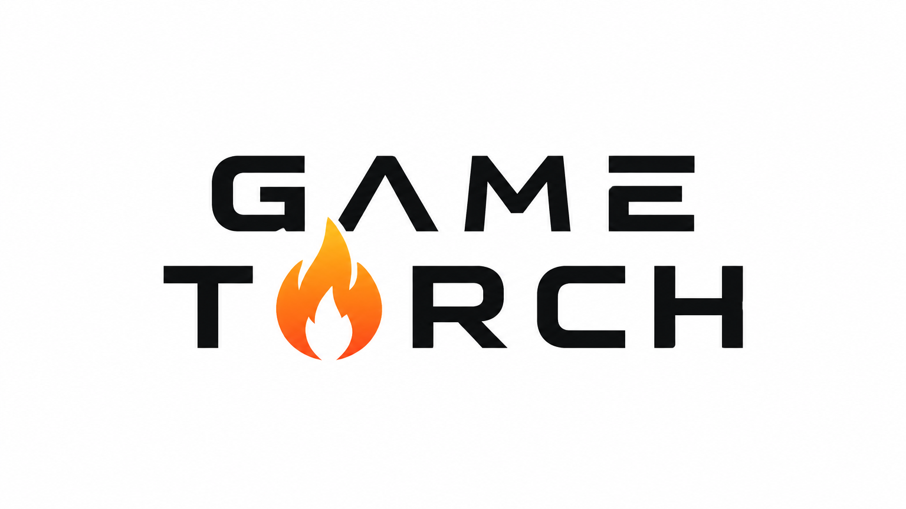

<p align="center">
  
</p>

<h1 align="center">GameTorch</h1>

<p align="center">
  <strong>Turn a sentence into game-ready sprites, sound effects and animations.</strong>
</p>

<p align="center">
  <a href="https://gametorch.app">Website</a> ·
  <a href="https://gametorch.app/api/docs">API reference</a> ·
  <a href="https://gametorch.app/llms.txt">Agent guide</a> ·
  <a href="#official-sdks">SDKs</a> ·
  <a href="#command-line-interface">CLI</a>
</p>

---

GameTorch is a generative asset studio for game developers. Describe what you
need — *"a red fox, side view"*, *"a sword unsheathing"*, *"walking to the
left"* — and GameTorch produces production-ready assets you can drop straight
into your project.

- **Sprites** — transparent, game-ready PNGs generated or edited from a prompt,
  from a reference image, or in a consistent art style you define once.
- **Sound effects** — short, looping and one-shot audio for weapons, impacts,
  UI and ambience.
- **Animations** — sprite animations and export presets for the tools you
  already use, with per-frame control when you want it.
- **Projects** — keep every asset organised, named, labelled and searchable,
  whether you work in the dashboard or entirely from code.

Everything is available through the web dashboard, a documented HTTP API, a
command-line interface, and first-class SDKs. It is built for people and for
agents: an API key, an optional spend limit, and the docs are all an autonomous
tool needs to generate assets safely.

## Works with what you use

GameTorch exports are built to drop straight into your pipeline:

`Godot` · `Unity` · `Unreal` · `Bevy` · `GameMaker` · `Aseprite` ·
`TexturePacker` · `Uniform Grid PNG` · and plain sprites, sounds and animations.

## Documentation

- **[API reference](https://gametorch.app/api/docs)** — an interactive,
  self-hosted reference for every endpoint, request and response.
- **[OpenAPI 3 spec](https://gametorch.app/api/openapi.json)** — generated from
  the server itself, so it is always in sync with the API.
- **[Agent guide (`llms.txt`)](https://gametorch.app/llms.txt)** — a concise
  index written for LLMs and autonomous agents.
- **[Full agent reference (`llms-full.txt`)](https://gametorch.app/llms-full.txt)**
  — the complete API surface in one file.

There is deliberately no MCP server. A plain, well-documented HTTP API is
faster, simpler and more reliable than a stateful shim in front of it.

## Command-line interface

The CLI is the fastest way to drive GameTorch, especially from an agent or a
script. It wraps the full public API — catalogs, projects, sprites, sounds,
animations, exports, labels, art styles, usage and API keys — with human-readable
output by default and `--json` whenever you need to parse it.

It lives in the [Rust SDK](https://github.com/gametorch/gametorch-rs) repository
and builds a binary named `gametorch`:

```sh
git clone https://github.com/gametorch/gametorch-rs
cargo install --path gametorch-rs/cli
```

Then authenticate and go:

```sh
export GAMETORCH_API_KEY=gt2_...          # create one at https://gametorch.app

gametorch health
gametorch catalog sprite
gametorch project create --name "My Game"
gametorch sprite generate --project my-game \
  --prompt "a red fox, side view" --wait
```

Every command supports `--json`, and commands that download content accept
`--output <file>` (`-` for stdout). Run `gametorch --help` for the full command
tree.

## Official SDKs

Every SDK covers the full public API with typed requests and responses, cursor
pagination, exact decimal money handling, and polite, rate-limit-aware retries
out of the box.

| Language | Install | Repository |
| --- | --- | --- |
| **Rust** | `cargo add gametorch` | [gametorch/gametorch-rs](https://github.com/gametorch/gametorch-rs) |
| **TypeScript** | `npm install gametorch` | [gametorch/gametorch-ts](https://github.com/gametorch/gametorch-ts) |
| **Python** | `pip install gametorch` | [gametorch/pygametorch](https://github.com/gametorch/pygametorch) |
| **Go** | `go get github.com/gametorch/gogametorch` | [gametorch/gogametorch](https://github.com/gametorch/gogametorch) |

```ts
// TypeScript
import { Client, SpriteMode } from "gametorch";

const client = Client.fromEnv();
const models = await client.spriteModels();

const job = await client
  .generateSprite(projectId)
  .prompt("a red fox, side view")
  .mode(SpriteMode.Single)
  .imageModel(models.image_models[0]!.id)
  .send();
```

## Authentication

Create an API key in the [dashboard](https://gametorch.app) and pass it as a
bearer token. Keys are shown once, can be scoped to a single project, and can
carry a daily, weekly or monthly spend limit so an automated key can never run
away with your budget.

```sh
Authorization: Bearer gt2_...
```

The API lives at `https://gametorch.app/api`, and every account is rate limited
per route with clear `429` responses and `Retry-After` headers — the official
SDKs and CLI handle all of that for you.

## License

MIT © GameTorch LLC. See the individual SDK repositories for their license
details.
